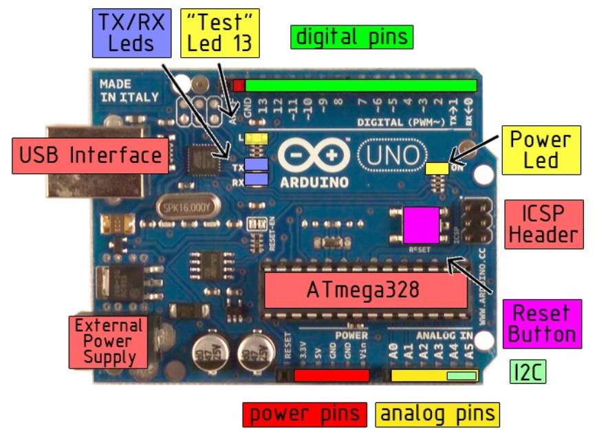
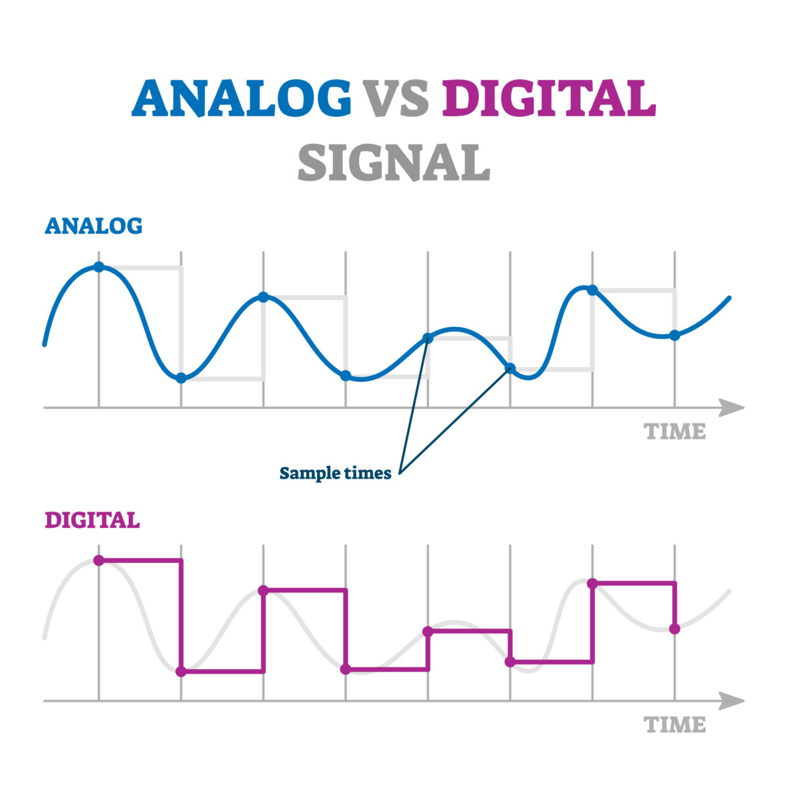

# Intro

Om te beginnen kun je de Arhuino IDE vast installeren, als je dat nog niet hebben gedaan. Hiervoor ga je naar https://www.arduino.cc/en/software en volg je de stappen. Je mag alle opties installeren, dus ook de usb driver.

## Inhoud


- [Arduino](#arduino)
- [Arduino IDE](#arduino-ide)
- [Opdracht 1](Opdracht1-sos.md)
- [Ledjes en knopjes](Ledjes-en-knopjes.md)
- [Opdracht 2](Opdracht2-LED-met-knop.md)
- [Opdracht 3](Opdracht3-Passive-Buzzer.md)


## Arduino

Een Arduino is een microcontroller en een veelgebruikt leerhulpmiddel voor embedded programming. Arduino is daarin een merk. Er zijn veel verschillende soorten microcontrollers, van groot tot klein. Een ander bekend merk is de Raspberry Pi, hoewel dat eignelijk een complete computer is. Het grote verschil tussen een Raspberry en een Arduino is dat een Arduino echt gemaakt is voor embedded devlopment, dus het werken met hardware componenten, zoals LED's, buttons en sensors.

Als je de Arduino ziet, dan zie je in feite een print plaat met wat componenten er op. De belangrijkste daarvan is de processor. Bij een Arduino Uno is dat een "ATmega238". Dit is verder niet heel belangrijk, maar het kan dus verschillen. Een andere populaire processor is de ESP32, dat is een open source processor. De Arduino processor heeft een geheugen van 32KB. Dat is niet veel, dus iets om rekening mee te houden.



Laten we even kijken naar de belangrijkste componenten op het bord: 
- Power Led: Dit is een van de ingebouwde LEDjes en zal gaan branden zodra je de Arduino aansluit met de USB kabel.
- Reset Button: Je kan je programma op de Arduino laden, maar je ook weer verwijderen. Dat doe je met de reset knop.
- USB Interface: De Arduino kun je aansluiten aan je computer met een USB kabel om je programma op je Arduino te laden. De Aruino heeft een type B USB poort.
- Test LED: Dit is een ingebouwde LED die is aangesloten op "pin 13" van de Arduino.
- Power Pins: Om een stroom circuit te maken moet je stroom van A naar B laten verlopen. B is altijd de "GND", de "ground" of "aarde". Hier zijn 3 pinnen voor, 2 aan de ene kant en 1 aan de andere kant van het bord. De A kan een 3.5 volt of een 5 volt pin zijn, afhankelijk van wat je wilt aansluiten.
- Analog pins: Er zijn 5 analoge pinnen op de arduino. Hier kun je modules op aansluiten die analoge waardes moeten lezen of schrijven. 
- Digitale pins: Er zijn 13 digitale pinnen. Deze gebruiken enkel digitale signalen, dus 1/0 of aan/uit of, zoals het bij Arduino heet HIGH/LOW. ([meer over digitaal en analoog](#bonus-verschil-tussen-digitaal-en-analoog))


## Arduino IDE

De Arduino IDE is een gratis ontwikkel omgeving ontworpen door de Arduino stichting. Het is ideaal voor het werken met een Arduino, omdat het direct de verbinding kan leggen met de Arduino. Je kunt dus je code uitschrijven en direct uploaden naar de Arduino. Ook andere IDE's, zoals VSCode, hebben plugins voor het werken met Arduino.

Zodra je de Arduino met je computer verbindt, zul je zien dat de "Power LED" gaat branden. Dit betekend echter nog niet dat de Arduine met de IDE verbonden is. Er zijn verschillende soorten Arduino en Microcontrollers, dus we moeten nog wel even instellen welke Arduino we hebben aangesloten. 

### Libraries
Om gebruik te maken van bepaalde sensors, zoals een dht11 (deze meet temperatuur en luchtvochtigheid), zul je gebruik moeten maken van libraries die methodes en klassen bevatten om zo'n module makkelijk te kunnen gebruiken. Libraries kun je importeren via de library manager, of via een gedownload .zip bestand. Om een library via de manager te downloaden ga je naar **Sketch > Include Library > Manage Libraries**. Daar kun je zoeken naar libraries die via het Arduino netwerk beschikbaar zijn gesteld. Soms wil je echter een library van een andere (maar betrouwbare) bron gebruiken. Dit kan in .zip format. Ga naar **Sketch > Include Library > Add ZIP Folder** om op deze manier een library toe te voegen. 

Je kunt de Library vervolgens in je code gebruiken door een **include** statement boven je code te zetten, zoals bijvoorbeeld `include<Arduino.h>`, een standaard import die de Arduino IDE al voor je doet.

### Bord
Om de IDE met je Arduino bord te verbinden, moet je de IDE vertellen welk bord je hebt verbonden. Hiervoor ga je naar `Tools > Board > Arduino AVR Boards` en daar selecteer je het juiste bord (Arduino Uno). Ook moet je de juiste port selecteren via `Tools > Port` en daar het juiste port te selecteren in de format: "ComX (arduino XXX)". 

Na het instellen van de juiste port, kun je gebruik maken van de Serial Monitor om input uit te lezen `Tools > Serial Monitor`

### Hello World

Laten we ons eerste programma bouwen. We gaan de ingebouwde test-LED (13) laten knipperen. Dit is de embedded-versie van een Hello World applicatie, zoals we die kennen uit bijvoorbeeld Java of Python.

Start een nieuw project `File > New Sketch`. Nu opent een nieuw venster met daarin de standaard code voor een sketch. 

```
void setup() {
  // put your setup code here, to run once:

}

void loop() {
  // put your main code here, to run repeatedly:

}
```

Dit is de standaard opzet voor een Arduino programma. De setup() methode wordt als eerste aangeroepen, eenmalig, zodra het programma ingeladen wordt. De loop() methode wordt constant aangeroepen, het "loopt", zolang de Arduino actief is.

Nou gaan we deze methodes invullen met de hello world code.

```
const int TEST = 13;                // Maak een variabele genaamd TEST en geeft het de waarde 13

void setup() {
  pinMode(TEST, OUTPUT);            // Stel pin 13 zo in dat deze pin een output moet geven, in plaats van een input ontvangen.

}

void loop() {
  digitalWrite(TEST, HIGH);         // LED aan (HIGH voltage setting)
  delay(1000);                      // wacht 1 seconde (1000 milliseconden)
  digitalWrite(TEST, LOW);          // LED uit (LOW voltage setting)
  delay(1000);                      // wacht 1 seconde
}
```

De code van Arduino wordt geschreven in c++. Dat lijkt in de basis erg veel op java, python of javascript. Er zitten slechts subtiele verschillen tussen het schrijven van loops, if-statements, variabelen of methodes in die talen. Dat komt omdat al deze talen deel zijn van de C-familie. Er van uit gaande dat je bekend bent met tenminste een van deze talen, kun je dus al een goed idee krijgen van de werking van de code, door alleen maar naar de code te kijken. Laten we er toch nog even in wat meer detail doorheen lopen. 

- `const int TEST = 13;`: Hier maak je een constante van type int. De waarde is 13. Dit is het pin nummer van de test LED op de arduino en tevens de 13e pin aan de digitale kant. Als alternatief kun je in je code ook de `LED_BUILTIN` variabele van de Arduino library gebruiken. Die wijst ook naar pin 13.
- `pinMode(TEST,OUPUT);`: Hier spreek je de "pinMode" methode van de Arduino library aan. Deze methode kan elke pin op de arduino instellen in OUTPUT modus of INPUT modus. Hier stellen we pin 13 in voor OUPUT modus, omdat we daar een LED willen laten branden. INPUT kun je bijvoorbeeld gebruiken voor een button of een sensor.
- `digitalWrite(TEST,HIGH)`: Hier spreek je de "digitalWrite" methode van de Arduino library aan. Hiermee kun de voltage output van een pin naar HIGH of LOW zetten. Op deze manier kun je een LED laten branden met een HIGH waarde en uit laten gaan met een LOW waarde.
- `delay(1000)`: Deze methode zet de loop even op pauze. Als je deze methode aanroep uit de code haalt, knippert het ledje nog steeds aan en uit, maar dit gaat dan zo snel, dat een menselijk oog dat niet meer kan waarnemen. Effectief ziet het er dan uit alsof het ledje op halve kracht brand. 

### Upload

De laatste stap is om je code te uploaden van je IDE naar je Arduino. Dit doe je door op de upload knop te drukken, die zie je links boven in het scherm, direct onder de menubalk. De eerste knop is "verify", om je code te builden. De tweede knop is "upload", om te builden en naar verbonden de Arduino te sturen.

Zodra je op upload drukt, zul je zien dat er wat lampjes gaan knipperen op de Aruino. Daarna zal je code in werking treden.


## Bonus

### (BONUS) Verschil tussen digitaal en analoog

Het verschil tussen digitaal en analoog is de waarde die je kunt uitlezen uit dat signaal. Elektriciteit is een golf. Een analoog signaal, maakt optimaal gebruik van die golf. Een digitaal signaal is geen golf, maar heeft een hoge waarde en een lage waarde. 


Een computer, zoals Arduino, leest een binnenkomend signaal uit in intervallen (klok snelheid). De timing van de interval bij een digitaal signaal luistert iets minder nauw, omdat het niet uitmaakt of je aan het begin, aan het eind of in het midden van de interval zit, de waarde is hetzelfde. Bij een analoog signaal maakt het wel uit als de timing iets eerder of iets later valt.

Let wel, het gaat hier om een schaal van +- 16MHz. Dat betekend dat je 16 miljoen intervallen per seconde hebt. In normale mensen taal is dat "heel snel".

Het digitale signaal van een Arduino heeft maar twee waardes, HIGH of LOW. Het analoge signaal heeft er 1024. 