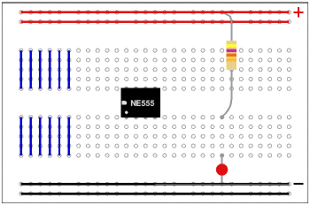
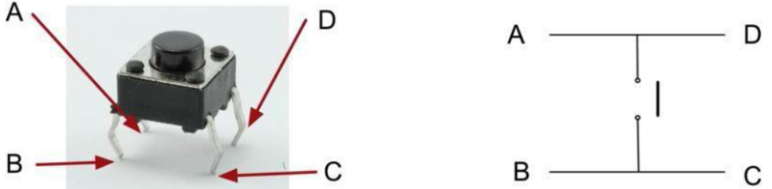

# Ledjes en knopjes

## Breadboard

Een Arduino is een printplaat waarop componenten zijn gesoldeerd. Zo'n printplaat heeft ingebouwde connecties tussen die componenten waardoor elektrische signalen, en dus communicatie, efficient kan worden gedeeld tussen de componenten. Je kunt de streepjes van de connecties meestal heel makkelijk zien met het blote oog. (Het patroon van de connecties wordt er letterlijk op geprint, zodat de componenten er vervolgens op gesoldeerd kunnen worden. Vandaar de "print" in printplaat)

Een breadboard is eigenlijk hetzelfde principe als een printplaat. Alleen hoef je op een breadboard niet de componenten te solderen. Op een breadboard kun je componenten aansluiten met draadjes en die vervolgens ook weer los halen. 

Je ziet in bovenstaand plaatje een schets van een breadboard. Je ziet dat het bestaan uit een matrix aan gaatjes waarin je pinnetjes kunt aansluiten. 

De bovenste twee rijen zijn horizontaal met elkaar verbonden. Hier sluit je doorgaans de 3.5 v of de 5v pin van de Arduino op aan, ofwel de +. 

De onderste twee rijen zijn ook horizontaal met elkaar verbonden. Hiet sluit je doorgaans de ground pin van de Arduino op aan, ofwel de -.

Je kunt ook het bord in twee delen door zowel onder als boven een enkele rij voor + en een enkele rij voor - te gebruiken.

In het midden zie twee blokken waarvan de gaatjes verticaal met elkaar zijn verbonden. Het nut hiervan is dat als je bijvoorbeeld de output van pin 13 op het bovenste gaatje van de eerste kolom aansluit, die complete kolom hetzelfde signaal krijgt. Zo kun je bijvoorbeeld verschillende ledjes laten branden op het signaal van pin 13.

## LED

Een LED (Light Emitting Diode) maakt van stroom licht. Een LED heeft een plus kant en een min kant. De plus is meestal het lange pootje en de min is het korte pootje. Bij een ronde LED kun je vaak ook een vlakking zien aan de min kant.

De negatieve kant kun je gewoon aansluiten op de GND van de Arduino (of via een breadboard), de positieve kant sluit je niet direct aan op de stroom toevoer. Je moet zorgen dat je er altijd een weerstand tussen zet, anders krijgt de LED te veel stroom en gaat het kapot. 

## Weerstand

Weerstand word in de electrotechniek gemeten in ohm (Ω). Een weerstand gebruik je door deze aan de + kant te plaatsen tussen de + en de module. Weerstanden zijn er in verschillende sterkes, zoals 220Ω, 1 kΩ en 10 kΩ. Deze laten elk minder stroom door, dus de LED zal minder fel branden met een 10kΩ weerstand dan met een 220Ω weerstand.

## Button

De button is een component dat digitale input geeft. Je kunt dus uitlezen welke input de button geeft en daar iets mee doen. De button heeft 4 pootjes, maar enkel een + en een - kant. Er zijn dus 2 positieve pootjes en 2 negatieve pootjes.

Door op de knop te drukken, maak je een verbinding tussen de beide kanten van de button waardoor de elektriciteit er door heen kan stromen. 

