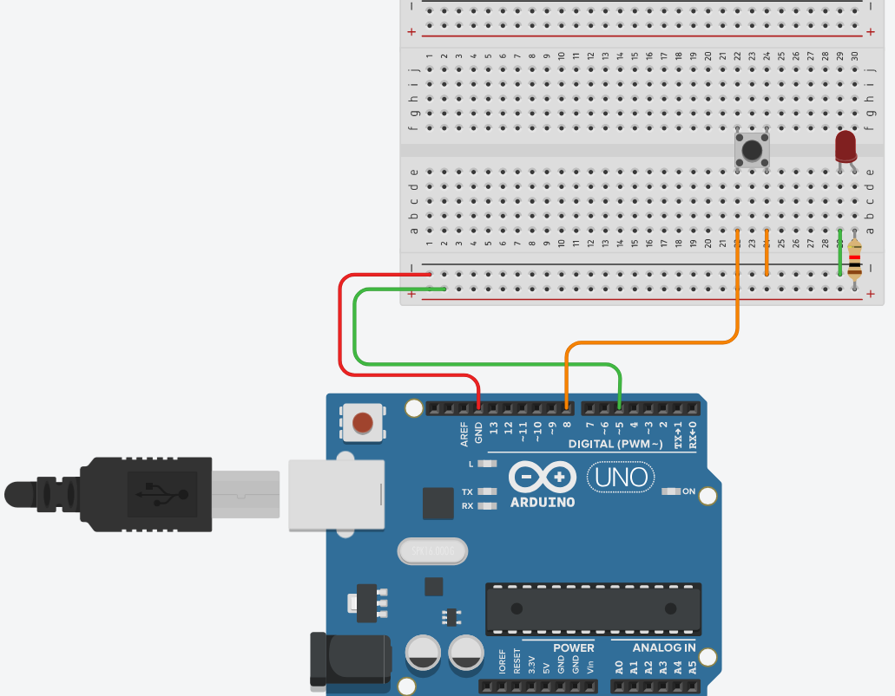

# Opdracht 2: LED met knop

Voor deze opdracht gaan we een LED aansluiten aan een button. Hier een stapsgewijze uitleg hoe je de componenten moet aansluiten:

- Sluit de min van het breadbord aan op pin 5
- Sluit de plus van het breadbord aan op gnd
- Plaats een LED op het breadbord
- Sluit de LED aan op plus
- Sluit de LED aan op min
- Plaats een button op het breadbord.
- Sluit de button aan op min
- Sluit de button aan op pin 8

<details>
<summary>Klik hier voor een schematische weergave van de opzet</summary>



</details>

Open nu een nieuwe sketch en schrijf de code waardoor de LED gaat branden als de button ingedrukt wordt.

- Gebruik pin 8 als de input van de button en zet die in INPUT_PULLUP mode `pinMode(8, INPUT_PULLUP);`. Deze modus zorgt dat je gebruik maakt van de interne zekering voor de button.
- Maak een if-statment die de staat (HIGH/LOW) checkt van pin 8 door gebruik te maken van `digitalRead(8)== LOW`. Let op, de button geeft dankzij de INPUT_PULLUP modus een LOW waarde als je het indrukt en een HIGH waarde als je het niet indrukt.

<details>
<summary>Klik hier voor de uitwerking</summary>

```
void setup()
{
pinMode(5, OUTPUT);
pinMode(8, INPUT_PULLUP);
}

void loop()
{
if(digitalRead(8)== LOW){
digitalWrite(5, HIGH);
} else {
digitalWrite(5, LOW);
}
}
```
</details>
